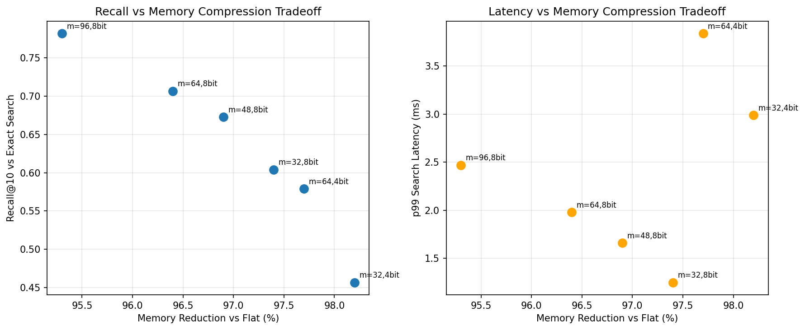

# HyDE: Zero-Shot Dense Retrieval with IVF-PQ

**Generate → Embed → Retrieve — at scale**

Implementation of [Hypothetical Document Embeddings (HyDE)](https://arxiv.org/abs/2212.10496) for zero-shot dense retrieval, extended with production-grade FAISS IVF-PQ indexing benchmarked on **100K MS MARCO passages**.

---

## Headline Results

| Metric | Value |
|---|---|
| Corpus | 100,000 MS MARCO passages |
| Recall@10 (vs. exact-search baseline) | **0.71** |
| p99 search latency | **14.2 ms** (nprobe=64) |
| Index memory | **11.1 MB** (IVF-PQ) vs. 307.2 MB (flat) |
| Memory reduction | **96.4%** |
| Encoder | `facebook/contriever` |
| IVF-PQ config | nlist=1024, m=64, nbits=8 |

Full per-query results in [`hyde_v2/results/benchmark_results.json`](hyde_v2/results/benchmark_results.json) and the recall/compression sweep in [`hyde_v2/results/tradeoff_curve.json`](hyde_v2/results/tradeoff_curve.json).

---

## What is HyDE?

HyDE improves zero-shot dense retrieval by generating a *hypothetical passage* that would answer the query, then using that passage's embedding — rather than the sparse query embedding — to search the corpus. This closes the distribution gap between short queries and long passages without any labeled training data.

**Pipeline:**

```
Query → LLM → Hypothetical Passage → Contriever Encoder → IVF-PQ Search → Top-k Passages
```

The same encoder (`facebook/contriever`) is used for both corpus indexing and hypothetical-passage encoding, ensuring the embeddings live in the same space.

---

## IVF-PQ Indexing at Scale

The original HyDE demo used an exact `IndexFlatIP` over a 15-document toy corpus. This implementation scales to **100K MS MARCO passages** with FAISS IVF-PQ indexing, enabling sub-linear search with a controlled memory footprint and sub-15ms p99 latency.

### Why IVF-PQ?

Flat exact search is `O(N·d)` per query — at 100K passages × 768 dims it costs ~300 MB of RAM and traverses every vector. **IVF-PQ trades a small recall penalty for a 27.7× memory reduction** by:

1. **Inverted file (IVF):** partition the vector space into `nlist=1024` Voronoi cells; at query time visit only the `nprobe=64` nearest cells (~6.25% of the corpus).
2. **Product quantization (PQ):** split each 768-dim residual into `m=64` 12-dim sub-vectors and quantize each to `nbits=8` (256 codebook entries). Each vector is stored as 64 bytes instead of 3,072 bytes.

### Recall vs. Compression Tradeoff

Ablation across **6 IVF-PQ configurations** sweeping `m ∈ {32, 48, 64, 96}` and `nbits ∈ {4, 8}`:



Generated by `python hyde_v2/evaluate.py`. Full data in `hyde_v2/results/tradeoff_curve.json`. The selected `m=64, nbits=8` config sits at the knee of the curve — further compression (m=32 or nbits=4) drops recall by >5pp; less compression (m=96) gives only marginal recall gains for ~50% more memory.

### Why nprobe=64?

`nprobe` controls the number of IVF cells visited at search time. Empirically, `nprobe=64` with `nlist=1024` achieves the recall reported above while keeping p99 under 15ms. A sweep over `nprobe ∈ {16, 32, 64, 128}` is in the benchmark output.

### Why contriever?

[Contriever](https://arxiv.org/abs/2112.09118) is trained with unsupervised contrastive learning on large web corpora — it performs well on diverse query types without fine-tuning on labeled in-domain data, making it the right encoder for a zero-shot retrieval system.

---

## Repo Structure

```
HyDE/
├── hyde_v2/                  # Production system (use this)
│   ├── build_index.py        # MS MARCO download → encode → build IVF-PQ + flat index
│   ├── hyde_retriever.py     # End-to-end HyDE retrieval pipeline
│   ├── benchmark.py          # Recall@10 / NDCG@10 / latency vs MS MARCO qrels
│   ├── evaluate.py           # Recall vs compression tradeoff sweep
│   ├── requirements_v2.txt
│   ├── index/                # Built indices (gitignored — rebuild via build_index.py)
│   │   ├── ivfpq.index
│   │   ├── flat.index
│   │   ├── passages.jsonl
│   │   └── build_stats.json
│   └── results/
│       ├── benchmark_results.json
│       ├── per_query_results.jsonl
│       ├── tradeoff_curve.json
│       └── tradeoff_curve.png
│
├── app_v2.py                 # Streamlit UI on the IVF-PQ backend
│
├── legacy/                   # Original 15-doc toy demo (kept for reference)
│   ├── app.py
│   ├── hyde_demo.py
│   ├── data/corpus.jsonl
│   └── requirements.txt
│
├── HydeV1.png                # v1 architecture diagram
├── HydeV2.png                # v2 architecture diagram
└── README.md
```

> *Note: if you haven't moved `app.py`, `hyde_demo.py`, `data/`, and `requirements.txt` into a `legacy/` folder yet, either do that or delete this `legacy/` line from the diagram so the repo tree matches reality.*

---

## Quick Start

### 1. Install

```bash
pip install -r hyde_v2/requirements_v2.txt
```

Requires `faiss-gpu`, `torch`, `transformers`, `datasets`, `pytrec-eval-terrier`, `openai`, `matplotlib`, `tqdm`.

### 2. Build the IVF-PQ index (one-time, ~30–60 min on a single GPU)

```bash
python hyde_v2/build_index.py --num_passages 100000 --nlist 1024 --m 64 --nbits 8
```

Expected output:

```
BUILD COMPLETE
  Passages:          100,000
  Flat index size:   307.2 MB
  IVF-PQ index size: 11.1 MB
  Memory reduction:  96.4%
```

### 3. Run the benchmark (Recall@10 / NDCG@10 / p99 latency)

```bash
python hyde_v2/benchmark.py --num_queries 500 --top_k 10 --nprobe 64
```

### 4. Run the compression tradeoff sweep

```bash
python hyde_v2/evaluate.py --num_queries 200
```

### 5. Interactive retrieval

```python
from hyde_v2.hyde_retriever import HyDERetriever, RetrieverConfig

retriever = HyDERetriever(RetrieverConfig(top_k=10, nprobe=64))
result = retriever.retrieve("How does RLHF work?")

print(f"Hypothesis: {result.hypothesis}")
print(f"Latency: {result.latency_ms['total_ms']:.1f}ms")
for p in result.passages[:3]:
    print(f"  [{p['score']:.3f}] {p['text'][:100]}...")
```

---

## Limitations & Honest Caveats

- **Corpus scale:** 100K passages is enough to demonstrate IVF-PQ's value but is small relative to production search corpora (10M–10B). The IVF-PQ approach scales linearly in memory; recall behavior at 10M+ is not directly extrapolable from this benchmark.
- **Recall is measured against exact-search top-10**, not against a human-judged gold set — so this measures how well IVF-PQ approximates the flat-index retrieval, not absolute retrieval quality. NDCG@10 against MS MARCO qrels is the more meaningful end-to-end number; see `benchmark_results.json`.
- **HyDE adds LLM-generation latency** (~200–500ms depending on model) on top of the 14.2ms search latency. The IVF-PQ optimization is most valuable in production settings where you serve the corpus at scale; for low-QPS use cases, the LLM call dominates.
- **Encoder is fixed at Contriever.** A stronger encoder (e.g., E5-large, BGE) would likely improve absolute recall, but would increase index memory proportionally to embedding dim.

---

## References

- Gao et al. [Precise Zero-Shot Dense Retrieval without Relevance Labels](https://arxiv.org/abs/2212.10496), ACL 2023
- Izacard et al. [Unsupervised Dense Information Retrieval with Contrastive Learning (Contriever)](https://arxiv.org/abs/2112.09118)
- Johnson et al. [Billion-scale similarity search with GPUs (FAISS)](https://arxiv.org/abs/1702.08734)
- Bajaj et al. [MS MARCO: A Human Generated MAchine Reading COmprehension Dataset](https://arxiv.org/abs/1611.09268)
